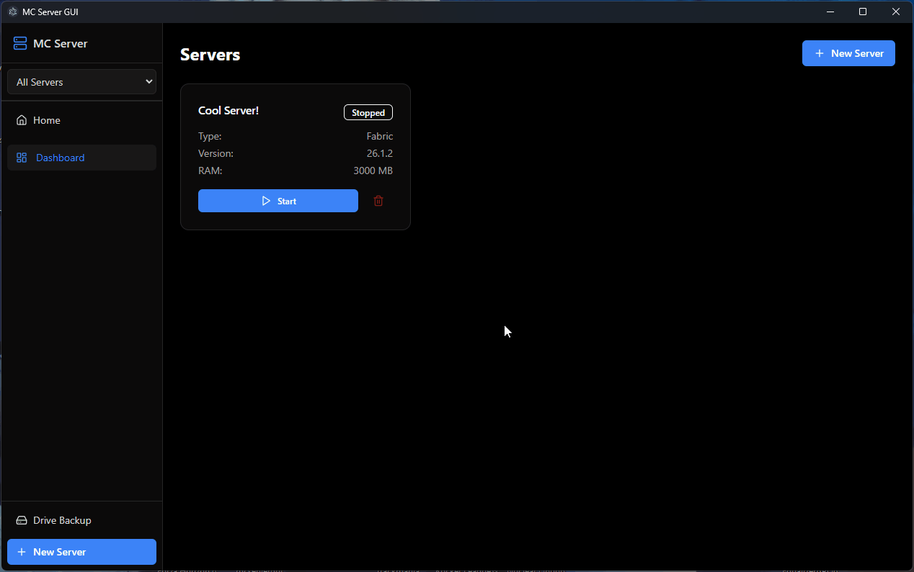

PS: This is my absolute first time using github and trying to create an app that any user can use with no problems, so any feedback of any kind wether it's for the github page or the app itself is very welcome and appreciated. if you want direct and fast contact with me for some issue you found or advice you wanna give pm on discord (user: drafted_name) send a friend request if you can't pm me


# Minecraft Server Manager

A standalone desktop application for managing Minecraft servers no command line, no VPS, no Docker. Java auto-downloaded on first launch. Packaged as a single Electron executable for Windows.

---

## Preview



---

## Getting Started : Regular Users

**No prerequisites.** Just download and run.

[**Download Latest Installer**](https://github.com/draftedname/mcservergui/releases/latest)

1. Download `MC Server GUI Setup x.x.x.exe` from the link above
2. Run the installer (default settings are fine)
3. Launch from the desktop shortcut or Start Menu

### Using the App

1. The app opens as a desktop window with the web dashboard
2. Click **New Server** in the sidebar to create your first server
3. Choose a type (Vanilla, Fabric, or Modpack from Modrinth)
4. Select a Minecraft version and set RAM, then click **Create**
5. On the server dashboard, click **Start**
6. Friends on the same WiFi can join at `192.168.x.x:25565`

### Making Your Server Public (no port forwarding)

1. Install playit.gg from [playit.gg/download](https://playit.gg/download)
2. In the app, go to your server's Dashboard
3. Toggle the **Networking** switch ON
4. Follow the on-screen guide to link your playit.gg account

### Changing the Web UI Port

Default port is `8080`. To change it, launch from a command prompt:

```
set MCSERVERGUI_WEB_PORT=9090
MC Server GUI.exe
```

---

## Getting Started: Developers

me and some ai :3 (all bugs and tests and security stuff are handled by me)

### Prerequisites

- Node.js 18+ ([nodejs.org](https://nodejs.org))
- pnpm: `npm install -g pnpm`
- Java JDK 17+ (for running test servers)
- Git

### Setup

```
git clone https://github.com/draftedname/minecraft_server_manager.git
cd minecraft_server_manager
pnpm install
```

### Dev Mode

```
pnpm dev
```

Starts the Express backend on port 3456 and Vite frontend on port 5173 with hot reload. Open [http://localhost:5173](http://localhost:5173).

### Production Build

```
pnpm build
npx electron-builder --win --dir
```

Output: `dist-electron/win-unpacked/MC Server GUI.exe`

### Installer

```
pnpm build
npx electron-builder --win
```

Output: `dist-electron/MC Server GUI Setup x.x.x.exe`

### Environment Variables

| Variable | Purpose | Default |
|----------|---------|---------|
| `MCSERVERGUI_WEB_PORT` | Web UI port | `8080` |
| `MCSERVERGUI_DATA_DIR` | Override data directory | OS sandbox |

## ⚠️ Known Issues

**Modpacks are currently in a broken state.** The mod filtering system may install client-only mods or skip server-required mods. Some modpacks may not work at all. This is being actively worked on — expect improvements in future updates.

---

## Features

- **Modpack installer** with 3-layer filtering (Modrinth API, blacklist, JAR inspection) to skip client-only mods
- **Log analysis** via mclo.gs — detects crashes, mod conflicts, and common problems
- **Modrinth browser** — search and install mods directly from the app
- **Fabric loader version selection** for modpacks and Fabric servers
- **World management** — import, backup (local + Google Drive), restore, activate, and delete
- **Console** with color-coded output, filtering, search, and mclo.gs analysis
- **File browser** with text editor integration
- **Playit.gg tunneling** for public access without port forwarding
- **Auto-Java download** if not found on the system
- **RAM allocation** with instant apply

---

## Tech Stack

| Layer | Technology |
|-------|-----------|
| Desktop Shell | Electron 34 |
| Backend | Node.js, Express 5, TypeScript, Socket.IO |
| Frontend | React 19, TypeScript, Vite 6, Tailwind CSS v4, shadcn/ui |
| Monorepo | Turborepo + pnpm workspaces |
| State Mgmt | TanStack React Query v5 |
| Mods API | Modrinth REST API v2 |
| Server Jars | Mojang version manifest, Fabric meta API |
| Cloud Backup | Google Drive API v3 (OAuth 2.0) |
| Tunneling | playit.gg via Windows Service Control Manager |
| Packaging | electron-builder 25 (NSIS) |

---

## License

GNU General Public License v3.0 see [`LICENSE`](LICENSE).

---

## Contact

- **Email:** imusingscout@gmail.com
- **X:** [@drafted_name](https://x.com/drafted_name)
- **Bugs & features:** [GitHub Issues](https://github.com/draftedname/mcservergui/issues)
- **Sponsorships:** email above
